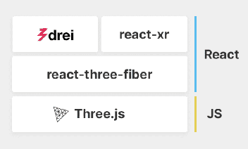
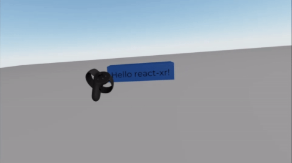

[react-xr](https://github.com/pmndrs/react-xr) is a collection of hooks to help you build XR experiences in react-three-fiber applications.
To make a VR React application we’ll use the following stack:



[Three.js](https://threejs.org/) is a library for 3D graphics, [react-three-fiber](https://github.com/pmndrs/react-three-fiber) is react renderer for Three.js, [drei](https://github.com/pmndrs/drei) is a collection of reusable components for r3f and react-xr is a collection of hooks to help you build XR experiences in react-three-fiber applications.

# react-xr 

As soon as you have a 3D scene using react-three-fiber you can make it available in VR or AR with react-xr. 

For that, the only thing you need to do is to replace `<Canvas>` component with `<VRCanvas>` or `<ARCanvas>` from react-xr package. It’s still the same canvas component but with all additional wiring necessary for VR to function.

Take a look at those simple example here:
### VR 
https://codesandbox.io/s/react-xr-simple-demo-8i9ro


### AR
https://codesandbox.io/s/react-xr-simple-ar-demo-8w8hm


You’ll notice that you now have "Enter VR/AR" button available at the bottom of the screen that should start the experience.

## Adding controllers
To add controllers you can use a component from react-xr package called `<DefaultXRControllers/>`. It will load appropriate controller models and put them in a scene.

```jsx
<VRCanvas>/* or ARCanvas */
    
    <DefaultXRControllers />
</VRCanvas>
```

## Interactivity

To interact with objects using controllers you can use `<Interactive>` component or useInteraction hook. They allow adding handlers to your objects. All interactions are rays that are shot from the controllers.

here is a short example
```jsx
const [isHovered, setIsHovered] = useState(false)

return (
  <Interactive onSelect={() => console.log('clicked!')} onHover={() => setIsHovered(true)} onBlur={() => setIsHovered(false)}>
    <Box />
  </Interactive>
)
```
You can also see this method in the two VR and AR examples aboves

## Learn more
We barely scratched the surface of what is possible with libraries like react-three-fiber and react-xr, I encourage you to check out more examples in GitHub repositories [here](https://github.com/pmndrs/react-xr) and [here](https://github.com/pmndrs/react-three-fiber). Remember, every r3f scene can be easily adjusted to be available in WebXR.